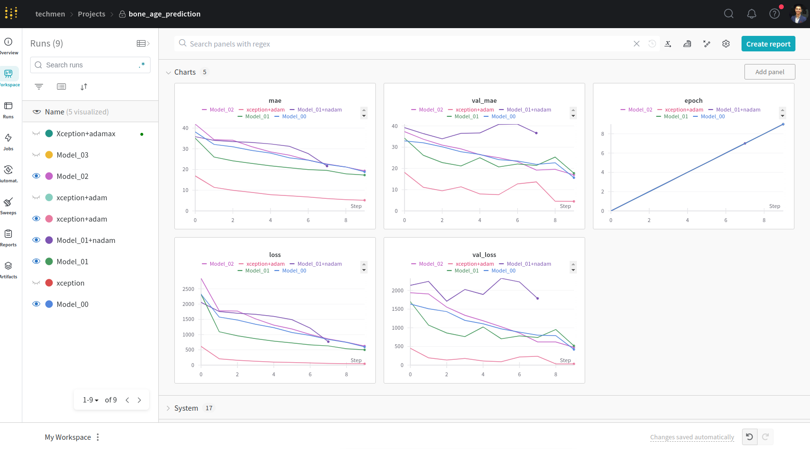
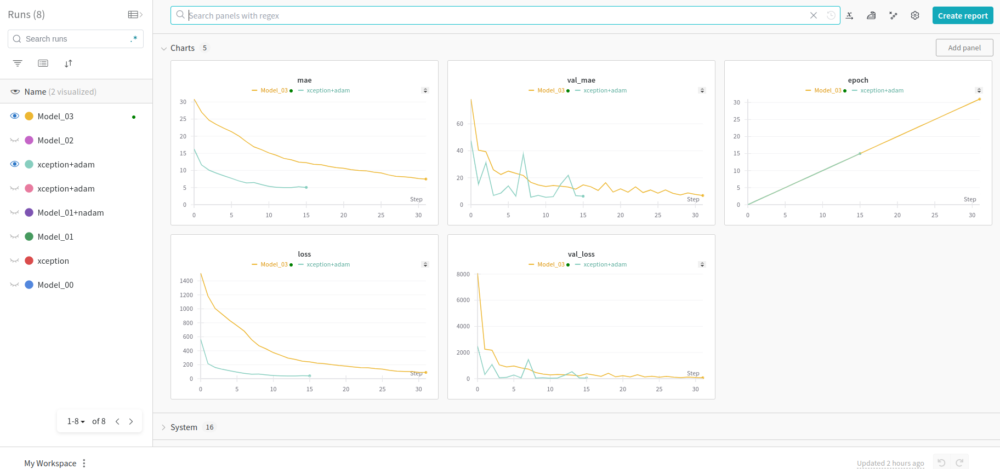
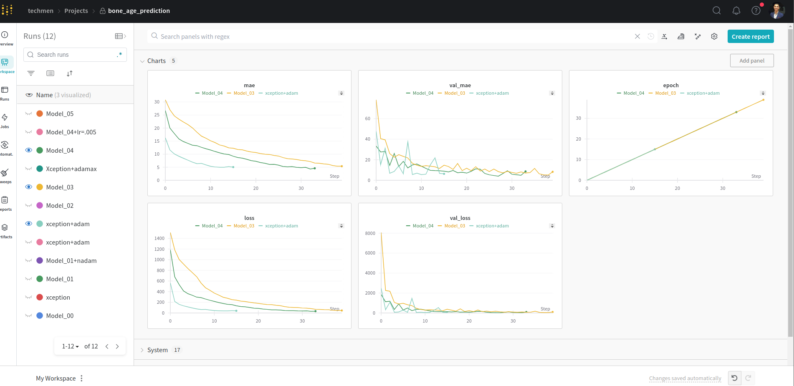
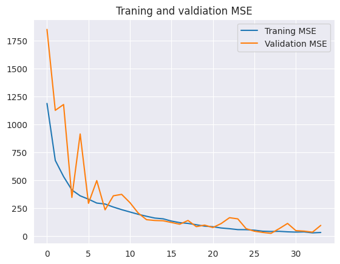
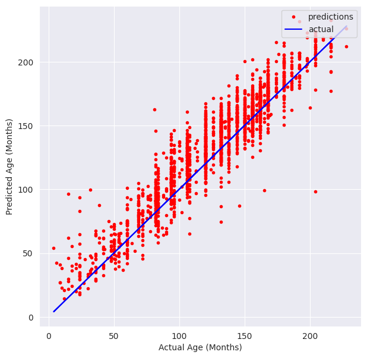

# Bone Age Prediction Model
Building a Deep Learning Regression model which predicts the age of a person for the X-ray scan of his hand.

### Preprocessing
* rescaling the image values to [0, 1]
* converting the images into gray scale since colors doesn't have significant meaning in X-ray images.
* resizing the images to 256x256

### Model
* developed a model similar to VGGnet model, loss function was MSE, tried different optimizers and altered the architecture of the model multiple times.

* tried a pre-trained model and compared it with the custome one

* this was the best model I reached before the deadline

### Evaluation
* Best MSE: 30.419 and Validation MSE: 36.53

* Best MAE: 4.316 and Validation MAE: 4.864

* Variance

