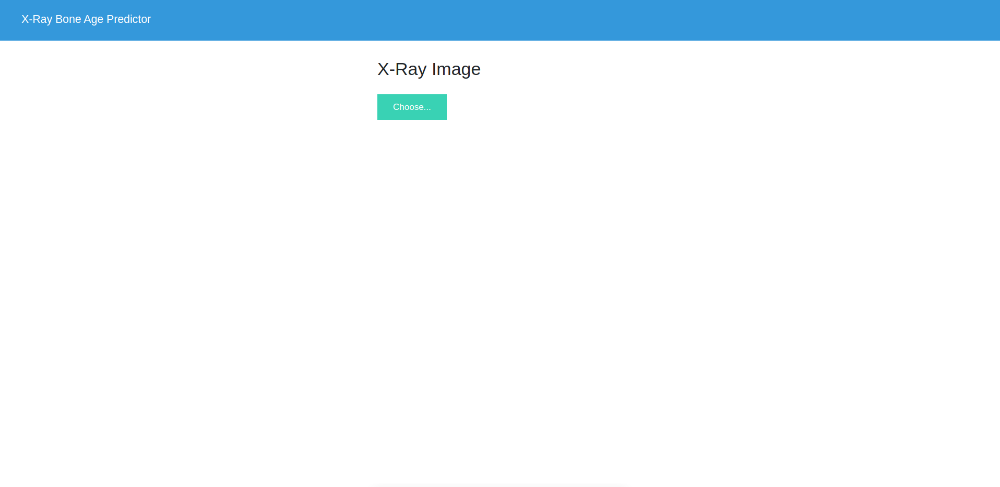
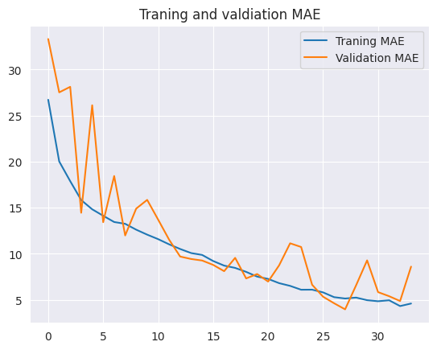

# Bone Age Prediction
This project was developmed in order to predict the age of a person based on the X-ray scan of the left hand.

### Interface
Worked with flask to deploy the model using a simple web page where the user is expected to upload an x-ray image of a left hand, after that the user should click on 'Predict' button and the predicted age will be displayed in monthes.

### Modeling
Experimented with transfer learning using Xception model and designed a custom model inspired from VGGnet.
Tracked my experiments utilizing [Weights&Biases](https://wandb.ai/site/).
Concluded my experiments with the custom modeling reaching less than 5 MAE.

